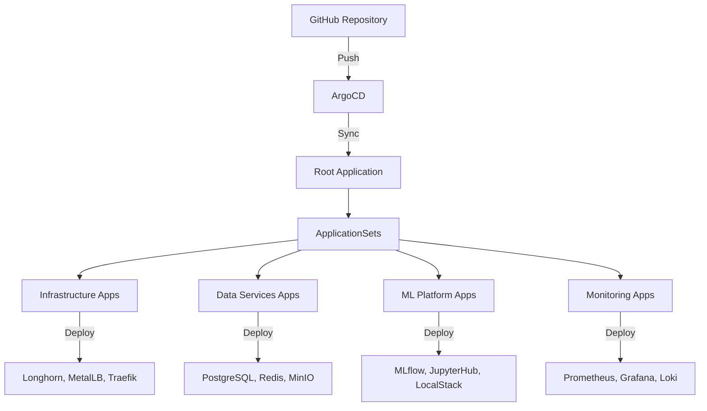

# Architecture Overview

## System Design

```
┌─────────────────────────────────────────────────────────────┐
│                     K3s Single Node (t495)                   │
│                         40GB RAM Total                       │
├─────────────────────────────────────────────────────────────┤
│                                                               │
│  ┌─────────────────────────────────────────────────────┐    │
│  │            Infrastructure Layer (3GB)                │    │
│  │  - Longhorn Storage                                  │    │
│  │  - MetalLB Load Balancer (20 IPs)                   │    │
│  │  - Traefik Ingress                                  │    │
│  └─────────────────────────────────────────────────────┘    │
│                                                               │
│  ┌─────────────────────────────────────────────────────┐    │
│  │              Data Services (6GB)                     │    │
│  │  - PostgreSQL (MLflow backend)                      │    │
│  │  - Redis (Caching)                                  │    │
│  │  - MinIO (S3-compatible storage)                    │    │
│  │  - Docker Registry                                  │    │
│  └─────────────────────────────────────────────────────┘    │
│                                                               │
│  ┌─────────────────────────────────────────────────────┐    │
│  │            ML Platform (8GB + 15GB reserved)        │    │
│  │  Current:                                           │    │
│  │  - MLflow (Experiment tracking)                     │    │
│  │  - JupyterHub (Notebooks)                          │    │
│  │  - LocalStack (AWS emulation)                      │    │
│  │                                                     │    │
│  │  Reserved for Kubeflow (15GB):                     │    │
│  │  - Pipelines                                       │    │
│  │  - KFServing/KServe                               │    │
│  │  - Katib                                           │    │
│  │  - Notebooks                                       │    │
│  │  - Central Dashboard                               │    │
│  └─────────────────────────────────────────────────────┘    │
│                                                               │
│  ┌─────────────────────────────────────────────────────┐    │
│  │              Monitoring (3GB)                        │    │
│  │  - Prometheus (Metrics)                             │    │
│  │  - Grafana (Visualization)                          │    │
│  │  - Loki (Logs)                                      │    │
│  │  - Promtail (Log collection)                        │    │
│  └─────────────────────────────────────────────────────┘    │
│                                                               │
│  ┌─────────────────────────────────────────────────────┐    │
│  │              System Buffer (5GB)                     │    │
│  │  - OS and K3s overhead                              │    │
│  │  - Temporary workloads                              │    │
│  └─────────────────────────────────────────────────────┘    │
│                                                               │
└─────────────────────────────────────────────────────────────┘
```

## IP Allocation Strategy

### Current Services (192.168.1.240-242)
- **192.168.1.240**: Traefik Ingress Controller
- **192.168.1.241**: MinIO S3 API (Direct Access)
- **192.168.1.242**: MLflow (Direct Access for notebooks)

### Reserved for Kubeflow (192.168.1.243-259)
- **192.168.1.243**: Istio Ingress Gateway
- **192.168.1.244**: Kubeflow Pipelines UI
- **192.168.1.245**: KServe Inference Service
- **192.168.1.246**: Katib UI
- **192.168.1.247**: Kubeflow Notebooks
- **192.168.1.248-259**: Additional Kubeflow services

## GitOps Workflow



## Resource Management

### Priority Classes
1. **infrastructure-critical** (1000)
2. **data-services** (900)
3. **kubeflow-critical** (850)
4. **ml-platform** (800)
5. **monitoring** (700)
6. **low-priority** (100)

### Resource Quotas per Namespace
- **data**: 6GB RAM, 3 CPU
- **mlflow**: 1GB RAM, 1 CPU
- **jupyter**: 4GB RAM, 2 CPU
- **localstack**: 2GB RAM, 1 CPU
- **monitoring**: 3GB RAM, 2 CPU
- **kubeflow**: 15GB RAM, 10 CPU (reserved)
